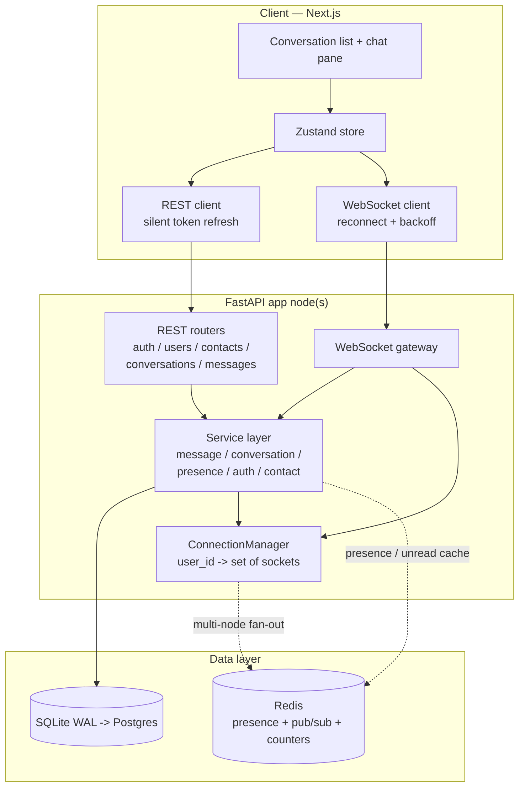
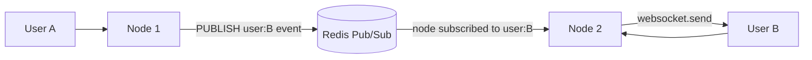
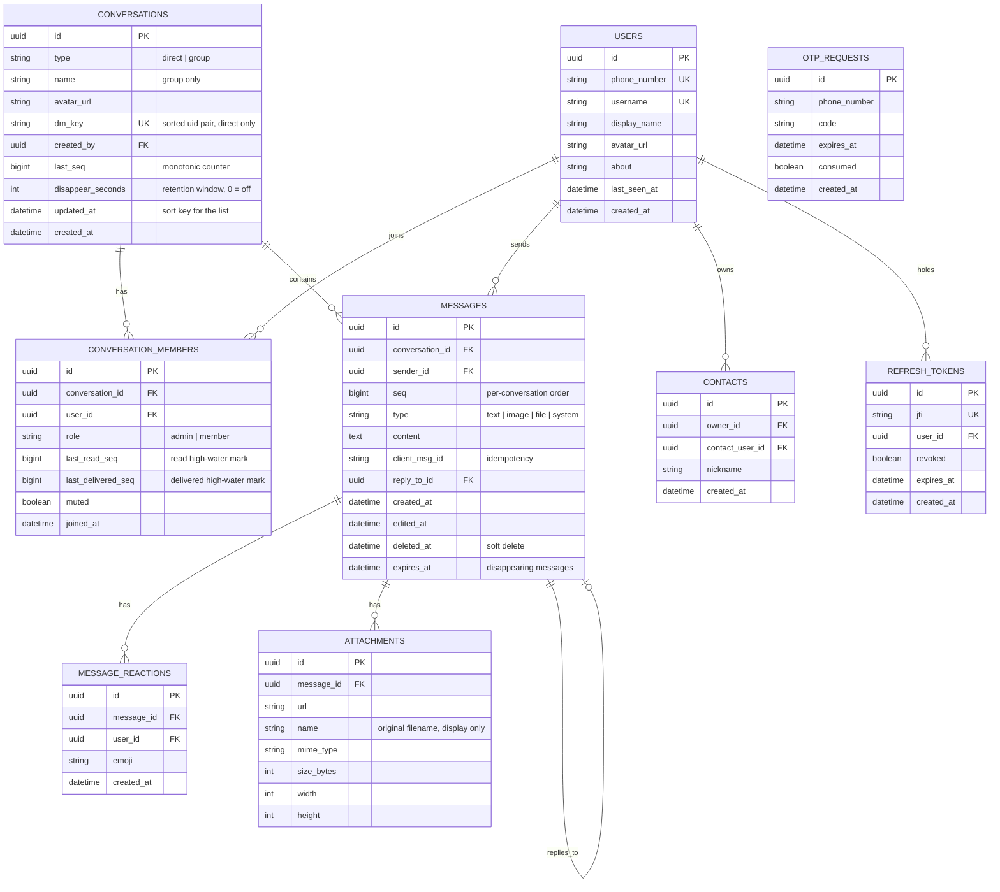

# System Design — Secure Messaging Platform (Signal Clone)

> Goal: recreate Signal's core messaging experience (1:1 + group, real-time, receipts, typing,
> presence) with a backend that is **correct first and horizontally scalable by design**. SQLite is
> the required store; every schema and interface decision is made so the same code path migrates to
> Postgres + Redis without a rewrite.

This document describes the system **as built**. Where the implementation went beyond the original
plan, the addition is called out.

---

## 1. Design goals & non-goals

**Goals**

- End-to-end working real-time messaging in a single-node deployment.
- Correct message ordering, delivery/read semantics, and durable persistence.
- An architecture where the *only* things between "single node" and "N nodes behind a load
  balancer" are a Redis Pub/Sub fan-out layer and a Postgres swap — no domain-logic rewrite.
- Signal-faithful UX (conversation list + chat pane, bubbles, receipts, typing, toasts).

**Non-goals (mocked, per the brief)**

- Real E2E cryptography — messages are stored in plaintext; §11 marks exactly where the Double
  Ratchet would sit.
- Real phone verification — OTP is a fixed code (`123456`), but the challenge lifecycle is real.
- Voice/video, stories, linked devices — "Coming Soon" placeholders.

---

## 2. Tech stack & rationale

| Layer | Choice | Why |
|---|---|---|
| Frontend | Next.js 16 (App Router) + TypeScript + Tailwind v4 | App Router lets the shell (socket, store, conversation list) stay mounted while the thread swaps. Tailwind v4's CSS-first `@theme` holds the Signal token set, themed by CSS variables. |
| Client state | Zustand | One store is where every socket event lands. Components subscribe to slices, so an incoming message does not re-render the app. |
| Backend | **FastAPI (async)** | Async-native: one process holds thousands of idle WebSocket connections on a single event loop. Pydantic gives typed contracts for free. Chosen over Django because the workload is I/O-bound real-time, not CRUD-heavy admin. |
| ORM | SQLAlchemy 2.0 (async) + Alembic | Async sessions; DB-agnostic, so SQLite → Postgres is a URL change plus a migration. |
| DB | SQLite in **WAL mode** | Required. WAL gives concurrent readers alongside a single writer — exactly the shape of a chat workload (read-heavy, short writes). |
| Real-time | Native FastAPI WebSockets | No broker needed at single-node scale; `ConnectionManager` is the seam where Redis Pub/Sub plugs in. |
| Auth | JWT access + rotating refresh | Access tokens are stateless, so any node validates any request. Only refresh tokens are stored — so logout can actually revoke a session. |
| Cache / fan-out (scale target) | Redis | Presence (TTL keys), unread counters, cross-node fan-out via Pub/Sub. |

---

## 3. High-level architecture



At single-node scope the `REDIS` box is absent: `ConnectionManager` is an in-process dict and
presence lives in memory. **The dashed edges are the only code that changes to go multi-node.**

---

## 4. Component breakdown

- **REST routers** — stateless request/response. Every mutation that produces a real-time event
  calls the service layer, which both persists *and* fans out.
- **WebSocket gateway** (`app/ws/gateway.py`) — authenticates the socket via `?token=<JWT>` on
  connect, registers it, then loops over typed event envelopes. It is pure transport: it looks up a
  handler, opens a short-lived DB session, and delegates. Errors become `error` events instead of
  killing the socket.
- **ConnectionManager** (`app/ws/manager.py`) — maps `user_id -> set[WebSocket]`, because one user
  can be connected from several tabs or devices. Exposes `connect`, `disconnect`,
  `send_to_users(user_ids, event)`. Fan-out is concurrent (`asyncio.gather`) and a dead socket is
  reaped without blocking the rest. **This is the single fan-out seam** (§9).
- **Service layer** — the domain core, and the only place business rules live.
  `MessageService.send()` persists, assigns the sequence number, then asks the ConnectionManager to
  deliver. `ConversationService`, `PresenceService`, `AuthService`, `ContactService` own their own
  invariants. `app/services/access.py` centralises "is this user a member / an admin".
- **Serializers** (`app/services/serializers.py`) — pure ORM → payload functions that take
  pre-loaded collections, so list endpoints batch their queries and never hit an N+1.

**Why REST and WebSocket cannot drift:** both call the same service functions. `POST
/conversations/{id}/messages` and the WS `message.send` event share
`message_service.send_message()`, so ordering, idempotency, receipts and fan-out are identical
whichever path a client takes.

---

## 5. Real-time message flow (the hot path)

```mermaid
sequenceDiagram
    participant A as Sender (User A)
    participant WS as WS gateway
    participant MS as MessageService
    participant DB as Database
    participant CM as ConnectionManager
    participant B as Recipient (User B)

    A->>WS: message.send {conversation_id, client_msg_id, content}
    WS->>MS: send_message(sender=A, ...)
    MS->>DB: check (conv, sender, client_msg_id) — idempotency
    MS->>DB: UPDATE conversations SET last_seq = last_seq + 1 RETURNING last_seq
    MS->>DB: INSERT message(seq); advance sender's own high-water marks; COMMIT
    MS-->>WS: message
    WS-->>A: message.ack {client_msg_id, message_id, seq, status: sent}
    MS->>CM: send_to_users(all members, message.new)
    CM-->>B: message.new {message}
    B->>WS: message.delivered {message_id}
    WS->>MS: mark_delivered
    MS->>DB: UPDATE member.last_delivered_seq
    MS->>CM: send_to_users([A], message.delivered {delivered_to})
    CM-->>A: message.delivered
    B->>WS: message.read {conversation_id, last_read_message_id}
    WS->>MS: mark_read
    MS->>DB: UPDATE member.last_read_seq
    MS->>CM: send_to_users([A], message.read {last_read_seq, read_by})
    CM-->>A: message.read
```

Notes on what the implementation actually does:

- `message.new` goes to **every** member including the sender, so the sender's other tabs stay in
  sync. Clients dedupe on `client_msg_id` / message id — which the optimistic UI needs anyway.
- The sender's own `last_read_seq` and `last_delivered_seq` advance on send, which is what keeps
  the unread subtraction (§8) correct.
- **Why WebSocket for send rather than REST:** one ordered channel per client, sub-100ms round
  trips for ack and typing, and no connection churn per message. `POST
  /conversations/{id}/messages` still exists as a fallback for clients without a live socket.

---

## 6. Message lifecycle & ordering

```
sending ──server persists──▶ sent (✓) ──recipients receive──▶ delivered (✓✓) ──recipients open chat──▶ read (✓✓ blue)
```

**Ordering.** Each conversation row carries `last_seq`. Sending performs a single atomic statement:

```sql
UPDATE conversations SET last_seq = last_seq + 1, updated_at = ? WHERE id = ? RETURNING last_seq
```

Two concurrent senders can never be handed the same number — SQLite serialises writers, Postgres
takes a row lock. This gives **gap-free per-conversation ordering with no reliance on wall clocks**,
which tie under load and skew across machines.

**Idempotency.** The client sends a `client_msg_id` (UUID).
`(conversation_id, sender_id, client_msg_id)` is unique. A retried send returns the existing message
rather than a duplicate — this is what makes the optimistic bubble safe, and what makes the REST
fallback safe when a queued socket frame lands later. A lost race on the unique index is caught and
resolved by re-reading the winner.

**Pagination.** Cursor-based on `seq` (`?before=<seq>&limit=50`), never `OFFSET` — O(log n) through
`idx_messages_conv_seq` and stable while new messages arrive mid-scroll. `?after=<seq>` walks
forward and is what a reconnecting client uses to backfill.

**Deletion** is soft (`deleted_at`), so Signal-style "This message was deleted" tombstones render
in place and the sequence stays gap-free.

---

## 7. Presence & typing

- **Presence:** on WS connect the user is marked online and `presence.update` is broadcast to
  everyone who shares a conversation with them (one query, not a fan-out per conversation). On the
  *last* socket closing, `last_seen_at` is stamped and offline is broadcast. A user with three tabs
  open goes offline only when the third closes. On connect the client is also told which of its
  peers are currently online, so presence renders immediately rather than on first event.
- **Typing:** `typing.start` / `typing.stop` are relayed to the other members and **never
  persisted** — zero DB cost. The client also expires stale indicators after ~4s, because a sender
  who closes their laptop never sends `typing.stop`.

At scale presence becomes a Redis key `presence:{user_id}` with a short TTL refreshed by the
client's `presence.ping` heartbeat (already implemented, every 25s); a node that misses two
heartbeats treats the user as offline.

---

## 7a. Attachments

Uploading is deliberately a **separate step from sending**:

1. `POST /attachments` (multipart) validates and stores the file, returning `{url, name, mime_type,
   size_bytes, width, height, kind}`.
2. The client references that metadata in `message.send`.

Two reasons. The hot message path stays pure JSON over the socket — no binary framing, no partial
message state on the wire — and a failed upload simply never produces a message, instead of
producing a half-broken one.

- **MIME allowlist, not a denylist.** Anything not explicitly permitted is refused with
  `422 UNSUPPORTED_MEDIA_TYPE`.
- **The client's filename never touches the filesystem.** Files are stored under a random UUID name
  with an extension derived from the *validated* MIME type; the original name is retained only as
  display metadata. This removes path traversal and extension-confusion as a class.
- **Streamed size check.** The body is read in 64 KB chunks and rejected the moment it passes the
  cap, so an oversized upload is never fully buffered.
- **Dimensions come from the browser.** The client measures an image's natural size and posts it
  alongside the file, so the bubble can reserve the right space before the image loads — and the
  server needs no image-decoding dependency (and no image-decoder CVE surface).
- Storage is confined to `app/services/attachment_service.py`. Moving to S3/R2 means reimplementing
  `store_upload` and `public_url`; nothing else in the codebase knows where bytes live.

**Known simplification:** files are served as static assets without an authorisation check, so
possession of the (unguessable) URL is sufficient. Real Signal encrypts attachment blobs client-side
and the server stores opaque ciphertext — which is the same place the message-content story lands.

---

## 7b. Disappearing messages

A per-conversation retention window (`conversations.disappear_seconds`, 0 = off) that any member can
set, as in Signal.

- On send, a message is stamped with `expires_at = now + disappear_seconds`. Existing messages are
  never retroactively expired — turning the timer on affects new messages only.
- **Expiry is enforced at read time**, not by the deletion job: every history query filters
  `expires_at IS NULL OR expires_at > now()`. A lapsed message therefore cannot be served even if
  the sweeper is stopped, behind, or crashed. **Correctness does not depend on a background job** —
  the job only reclaims storage.
- A sweeper task (started with the app, cancelled on shutdown) hard-deletes expired rows every 20s
  and pushes `message.expired` so open clients drop them live. The client additionally prunes
  locally once a second, so a message vanishes on time with no round trip.
- Changing the setting posts a system message into the thread, so the change is auditable in the
  conversation itself rather than being silent.
- `messages.expires_at` is indexed, so the sweep is an index range scan rather than a table scan.

The trade-off worth naming: the timer starts when the server accepts the message, not when the
recipient reads it. Read-triggered expiry would need a per-recipient timer row, which is exactly the
O(messages × members) explosion that §8 avoids for receipts.

---

## 8. Read receipts — high-water marks (the scalability decision)

A naive design writes one `receipt(message_id, user_id, status)` row per message per member — that
is O(messages × members) rows and it kills a group chat. Instead:

- `conversation_members.last_read_seq` and `last_delivered_seq` are **high-water marks**.
- A message with `seq = S` is *read by member M* **iff** `M.last_read_seq >= S`.
- Marking a whole thread read is **one UPDATE**, not N inserts.
- "Read by 5 of 8" is a count over the member rows — no extra table.
- Unread badge = `conversation.last_seq - member.last_read_seq`: **a subtraction, not a COUNT(\*)**,
  and trivially cacheable in Redis on the hot path.

**Group tick semantics.** A tick advances only when *every* recipient has reached that state, so one
person reading a group message does not turn the sender's ticks blue. The receipt events therefore
carry `delivered_to` / `read_by` counts, and the client compares them against the member count.

**Trade-off, stated plainly:** this buys O(1) writes at the cost of per-message granularity — you
cannot ask "at what second did Bob read *this specific* message". Production chat systems make the
same trade, and it is the right one for group scale.

---

## 9. Scalability — single node → N nodes

The whole design hinges on one seam: **`ConnectionManager.send_to_users()`**.

**Now:** an in-process dict. Sender and recipient are on the same process, so delivery is a direct
`websocket.send_json()`.

**The problem at 2+ nodes:** User A is connected to Node 1, User B to Node 2. Node 1 holds no socket
for B.



- Each node subscribes to a channel per user it currently holds (`user:{id}`).
- `send_to_users()` delivers to local sockets first, then `PUBLISH`es for the remainder.
- The owning node receives the message and pushes it down the live socket.
- `InMemoryConnectionManager` is swapped for `RedisConnectionManager` behind the same
  `BaseConnectionManager` interface — **no service-layer changes.** The abstract base class exists
  in the code today for exactly this reason.

**Other scale levers, in priority order**

1. **SQLite → Postgres.** URL plus Alembic migration. Removes the single-writer bottleneck and adds
   real connection pooling. Nothing in the domain code knows which engine it is on.
2. **Offline delivery / reconnect sync.** Already built: messages persist before fan-out, and a
   reconnecting client calls `?after=<last_seen_seq>` rather than replaying socket events. The DB is
   the source of truth; the socket is the fast path.
3. **Stateless app tier.** JWT means any node serves any REST request — trivial horizontal scale and
   rolling deploys.
4. **Hot-path caching in Redis.** Conversation-list metadata, unread counts and presence are the
   most-read data; cache with write-through invalidation on new messages.
5. **Durability at very large scale.** A broker (Kafka/NATS) between ingest and fan-out, partitioned
   by `conversation_id`, so ingest survives node loss and consumers scale independently. IDs move
   from a per-conversation counter to Snowflake/ULID to stay ordered without a shared counter.
6. **WebSocket sharding.** A dedicated gateway tier (sticky by `user_id`) separate from the API
   tier, so socket fan-out and request/response scale on independent curves.

**Query discipline that makes the list endpoint cheap.** `GET /conversations` is **three queries
regardless of page size**: the page of conversations, every member row for that page, and each
conversation's last message (joined on `seq == last_seq`). Previews, unread counts, member counts,
peer identity and receipt state are all computed from those three results — no N+1.

---

## 10. Database schema



`REFRESH_TOKENS` and `OTP_REQUESTS` were added during implementation: the first so logout and
rotation can genuinely revoke a session, the second so the mocked OTP still has a real, expiring,
single-use challenge lifecycle.

**Key constraints & indexes**

- `conversations.dm_key = min(uidA,uidB) + ':' + max(uidA,uidB)` with a **unique index** — exactly
  one DM between any two users; "start chat" is an idempotent get-or-create, and a simultaneous
  double-tap resolves to the winner rather than erroring.
- **`idx_messages_conv_seq (conversation_id, seq)`** — the single most important index: it powers
  ordered pagination *and* every receipt comparison.
- `idx_members_user (user_id)` — load a user's conversation list.
- `idx_conversations_updated (updated_at)` — list sorted by recent activity.
- `uq_message_idempotency (conversation_id, sender_id, client_msg_id)` — dedupes retries.
- `uq_reaction (message_id, user_id, emoji)` — one of each emoji per user per message.
- `uq_member (conversation_id, user_id)` — no double membership.
- `idx_messages_expires_at (expires_at)` — makes the disappearing-message sweep an index range
  scan rather than a table scan.
- Timezone handling is normalised by a custom `UTCDateTime` column type, because SQLite drops
  `tzinfo` on the way out and Postgres does not. Application code never has to care which it is on.

---

## 11. Security notes (assignment-scoped)

- JWT signed HS256; short-lived access token (15 min) plus refresh token (7 days) with **rotation on
  use** — the presented refresh token is revoked as the new pair is issued, so replay fails.
- Every REST route and the WS handshake authorise membership: a user can only read or write
  conversations they belong to, checked through `conversation_members`. Membership failures return
  **404, not 403**, so conversation ids cannot be probed for existence.
- Admin-only actions (add member, remove member, rename) check the member role; self-leave is
  explicitly allowed without admin; mute is a per-member preference and is not admin-gated.
- **Mock encryption:** payloads are stored in plaintext. In a real build the Signal Double Ratchet /
  X3DH would live client-side — encrypt before send, and the server would store ciphertext blobs it
  cannot read. Nothing in this schema or API would need to change; only `content` becomes opaque.
- Input is validated by Pydantic before any DB write; content length is capped (8 KB default).
- Rate limiting on the send path (20 messages / 10s / user), returning `RATE_LIMITED`.
- CORS is explicit-origin with a regex allowance for `*.vercel.app` preview deployments;
  credentials are not required because auth rides on the `Authorization` header, not cookies.

---

## 12. Trade-offs & assumptions

- **SQLite single-writer** is acceptable here (WAL + short transactions), and the design does not
  *depend* on SQLite anywhere. Called out explicitly rather than hidden, because it is the first
  thing that breaks under real concurrency.
- **In-memory presence and connections** are per-process. A second instance today would mean two
  users on different nodes not seeing each other live — which is exactly what §9 fixes.
- **High-water-mark receipts** trade per-message granularity for O(1) writes. The right call for
  group scale.
- **Ephemeral typing** means a typing indicator can be missed entirely if the socket blips. That is
  correct: a missed typing event has no consequence, which is precisely why it is not persisted.
- **New members do not inherit the backlog as unread** — their high-water marks start at the
  group's current `last_seq`. Joining a busy group shows 1 unread (the system message), not 400.
- **Uploaded files are served without an auth check.** Possession of the random URL is enough. Real
  Signal stores client-encrypted blobs; this build stores plaintext files, consistent with storing
  plaintext message content.
- **Disappearing messages expire from send time, not read time.** Read-triggered expiry needs a
  per-recipient timer row — the same O(messages × members) explosion §8 avoids for receipts.
- **Seed users are trusted.** Contact requests and blocking are out of scope; the `contacts` table
  is where they would attach.
